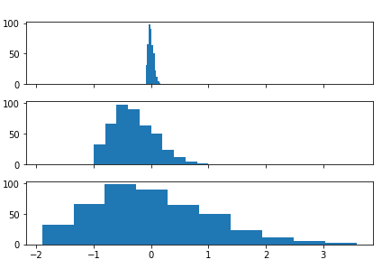
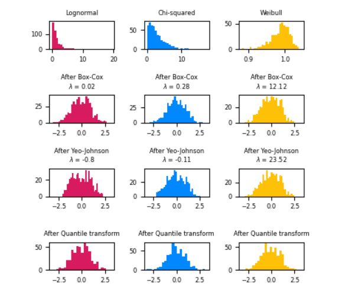
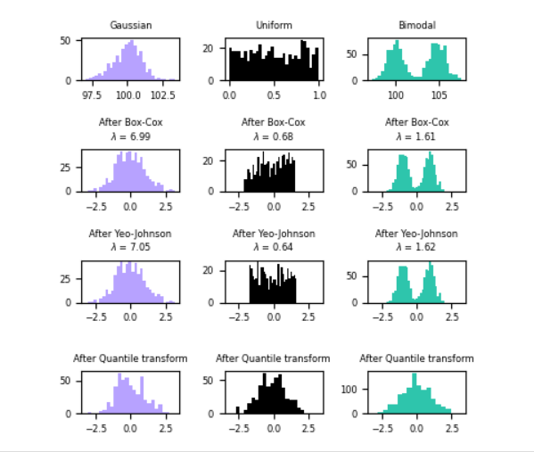
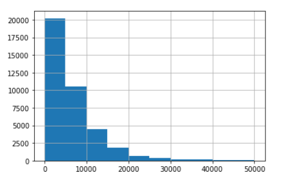
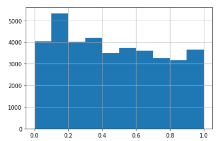

## Procesamiento de datos numéricos en Python

| Source:       | https://platzi.com/clases/estadistica-descriptiva/           |
| ------------- | ------------------------------------------------------------ |
| **Course:**   | Curso de Matemáticas para Data Science: Estadística Descriptiva |
| **Teacher:**  | Francisco Camacho                                            |
| **Notebook:** | [Personal deepnote](https://deepnote.com/project/curso-estadistica-descriptiva-2021-Duplicate-7uTueWZDQ-aKrq24bLdf2A) |

## Notes

### Transformaciones Lineales

```python
import timeit
import numpy as np
import pandas as pd 
import matplotlib.pyplot as plt
from sklearn import datasets, linear_model

X, y = datasets.load_diabetes(return_X_y=True)
raw = X[:, None, 2] # Ojo con esta transformacion, solo tomamos la (0, 1, 2) 
# tercera columna de X
# X shape es (442,10) y raw shape es( 442,1)
```

#### La transformación: `raw = X[:, None, 2]`

Esta transformación puede crear un poco de confusión si no conoces algunos detalles sobre NumPy. Para las dudas te detallo un poco que hizo en esta línea de código.

------

> **Note:** `X` tiene un shape de `(442, 10)` para nuestro estudio solo necesitamos una columna, buscamos tener un `raw` con shape `(442, 1)`

------

1. `:` toma todas las columnas y filas.
2. `None` indica la transformación del arreglo (newaxis)
3. `2` Selecciona la 3ra columna de X.

------

> Más información sobre [Numpy Newaxis](https://numpy.org/doc/stable/reference/constants.html#numpy.newaxis)

Note: La razon del None en la transformacion anterior viene de `numpy.`newaxis [Numpy Newxis](https://numpy.org/doc/stable/reference/constants.html#numpy.newaxis)

A convenient alias for None, useful for indexing arrays.

[Informacion dataset ...](https://scikit-learn.org/stable/modules/generated/sklearn.datasets.load_diabetes.html)

```python
# escalamiento max-min
max_raw = max(raw)
min_raw = min(raw)
scaled = (2*raw - max_raw -min_raw)/(max_raw - min_raw)
```

```python
# normalización Z-score
avg = np.average(raw)
std = np.std(raw)
z_scaled = (raw - avg)/std
```

```Python
fig, axs = plt.subplots(3, 1, sharex=True, tight_layout=True)

axs[0].hist(raw) # Grafica de datos sin normalizar
axs[1].hist(scaled) # Grafica de datos normalizados con max-min
axs[2].hist(z_scaled) # Grafica de datos normalizados con z-score
```



[Preprocessing data scikit learn](https://scikit-learn.org/stable/modules/preprocessing.html)

[Map data to a normal distribution](https://scikit-learn.org/stable/auto_examples/preprocessing/plot_map_data_to_normal.html)





```python
# modelos para entrenamiento
def train_raw():
    linear_model.LinearRegression().fit(raw, y)

def train_scaled():
    linear_model.LinearRegression().fit(scaled, y)

def train_z_scaled():
    linear_model.LinearRegression().fit(z_scaled, y)
```

```python
raw_time = timeit.timeit(train_raw, number = 100) # number = 100 repite la ejecucion 
# de la funcion train_raw unas 100 vcs y me devuelve el tiempo que le toma
scaled_time = timeit.timeit(train_scaled, number = 100)
z_scaled_time = timeit.timeit(train_z_scaled, number = 100)

print('trainning time for raw data : {} '.format(raw_time))
print('trainning time for scaled data : {}'.format(scaled_time))
print('trainning time for z_scaled data : {}'.format(z_scaled_time))
```

- max-min scaling: mejor para datos uniformemente distribuidos
- z-score scaling: mejor para datos distribuidos "normalmente" (forma de campana de gauss)

```bash
trainning time for raw data : 0.0413824810020742 
trainning time for scaled data : 0.03200999199907528
trainning time for z_scaled data : 0.029494894999515964
```

### Transformaciones no lineales

```python
df = pd.read_csv('cars.csv')
```


```python
df.price_usd.hist()
```



```python
#Transformación con tanh(x)
p = 10000
df.price_usd.apply(lambda x: np.tanh(x/p)).hist()
```


- mapear datos a una distribucion gaussiana: https://scikit-learn.org/stable/auto_examples/preprocessing/plot_map_data_to_normal.html#sphx-glr-auto-examples-preprocessing-plot-map-data-to-normal-py



