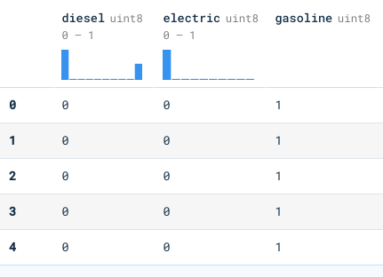

## Pipelines de procesamiento para variables categóricas

| Source:       | https://platzi.com/clases/estadistica-descriptiva/           |
| ------------- | ------------------------------------------------------------ |
| **Course:**   | Curso de Matemáticas para Data Science: Estadística Descriptiva |
| **Teacher:**  | Francisco Camacho                                            |
| **Notebook:** | [Personal deepnote](https://deepnote.com/project/curso-estadistica-descriptiva-2021-Duplicate-7uTueWZDQ-aKrq24bLdf2A) |

## Notes

#### Mapeos Numericos:

**Dummy**

* Representacion compacta.
* Mejor Para inputs linealmente independientes.

**One-hot**

* Premite describir categorias no incluidas inicialmente. 

[**Bin Counting** y **Feature Hashing**](https://platzi.com/clases/2353-estadistica-descriptiva/38407-pipelines-de-procesamiento-para-variables-categori/url)

## Procesamiento para variables categóricas con Python

Tratar variables numericas como categiricas ? Si, depende tu caso de analisis. 

| Categoria | Dummy | One hot   |
| --------- | ----- | --------- |
| Ingles    | [0,0] | [1, 0, 0] |
| Espanol   | [0,1] | [0, 1, 0] |
| Frances   | [1,0] | [0, 0, 1] |

Dummy (Esto no existe en las librerias de python)

```python
nan -> ? # No hay manera de introducir valores nan o desconocidos
```

One hot (Es la mas utilizada)

```python
nan -> [0, 0, 0] # Si existe posibilidad de introducir valores desconocidos
```

En pandas existe una funcion que se llama `get_dummies()` en  realidad esta funcion trabaja como el `one-hot`

```python
import pandas as pd 

df = pd.read_csv('cars.csv')
```

Pandas dummies: https://pandas.pydata.org/docs/reference/api/pandas.get_dummies.html

```python
pd.get_dummies(df['engine_type'])
```



One-hot con Scikit: https://scikit-learn.org/stable/modules/preprocessing.html#encoding-categorical-features

```python
import sklearn.preprocessing as preprocessing
encoder = preprocessing.OneHotEncoder(handle_unknown='ignore')

encoder.fit(df[['engine_type']].values)

encoder.transform([['gasoline'],['diesel'],['aceite']]).toarray()
# Observar que Aceite no se encuentra dentro de nuestro dataset
# Para aceite tenemos [0, 0, 0]

#output
array([[0., 0., 1.],
       [1., 0., 0.],
       [0., 0., 0.]])
```

Variables numéricas discretas pueden ser codificadas como categoricas

```python
encoder.fit(df[['year_produced']].values)
encoder.transform([[2016],[2009],[190]]).toarray()
```

