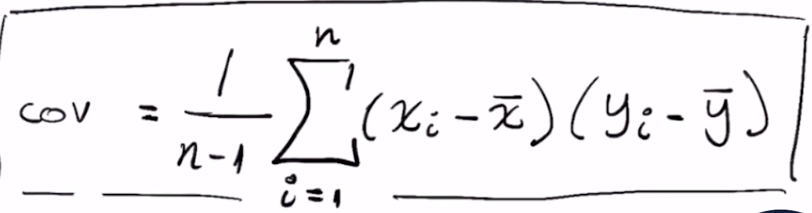
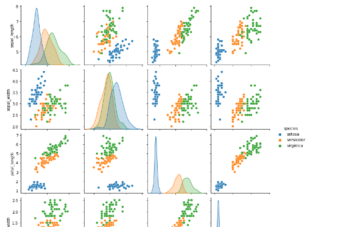
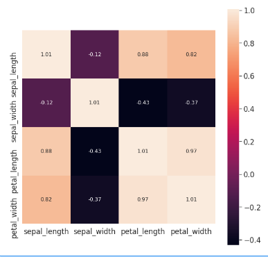

## Correlaciones

| Source:       | https://platzi.com/clases/estadistica-descriptiva/           |
| ------------- | ------------------------------------------------------------ |
| **Course:**   | Curso de Matemáticas para Data Science: Estadística Descriptiva |
| **Teacher:**  | Francisco Camacho                                            |
| **Notebook:** | [Personal deepnote](https://deepnote.com/project/curso-estadistica-descriptiva-2021-Duplicate-7uTueWZDQ-aKrq24bLdf2A) |

## Notes

Si desean profundizar sobre la definicion del coeficiente de correlacion, les recomiendo leer a partir de la pagina 147 de este libro: https://cims.nyu.edu/~cfgranda/pages/stuff/probability_stats_for_DS.pdf  fue uno de los libros guía para el curso.

## Dato curioso:

Lo que meciona Pacho al inicio de la clase, en econometría se le conoce como multicolinealidad que es una situación en la que se presenta una fuerte correlación entre variables del modelo.

### Hay 2 tipos de multicolinealidad:

- **Multicolinealidad exacta:** Hay colinealidad exacta, cuando una o más variables, son una combinación lineal de otra, es decir, existe un coeficiente de correlación entre estas dos variables de 1.
- **Multicolinealidad aproximada:** Hay colinealidad aproximada, cuando una o más variables, no son exactamente una combinación lineal de la otra, pero existe un coeficiente de determinación entre estas variables muy cercano al uno.

#### ¿Qué es la correlación?

- La correlación es una medida estadística que expresa hasta qué punto dos variables están relacionadas linealmente (esto es, cambian conjuntamente a una tasa constante).
- [-1, 1] es el rango de la correlacion

#### ¿Qué es la covarianza?

- Es un valor que indica el grado de variación conjunta de dos variables aleatorias respecto a sus medias.

#### ¿Qué es el coeficiente de correlación?

- El coeficiente de correlación es la medida específica que cuantifica la intensidad de la relación lineal entre dos variables en un análisis de correlación.

### Correlación gráficamente:


> Siempre debemos considerar que: Correlación no implica causalidad.

Nota: Cuando dos variables estan altamente correlacionas pueden estar aportando la  misma informacion a un modelo de machine learning. Algunas veces se analiza la correlacion para sacar algunas variables del modelo que no esten aportando informacion (Reducir datos). 



## Matriz de covarianza

Podemos usar También el método de Pandas: dataframe.corr()

```
corr_matrix = iris.corr()
```

## Matriz de covarianza

Una matriz de varianzas-covarianzas es una matriz cuadrada que contiene las varianzas y covarianzas asociadas con diferentes variables. Los elementos de la diagonal de la matriz contienen las varianzas de las variables, mientras que los elementos que se encuentran fuera de la diagonal contienen las covarianzas entre todos los pares posibles de variables.

```python
import numpy as np 
import matplotlib.pyplot as plt
import seaborn as sns
from sklearn.preprocessing import StandardScaler

iris = sns.load_dataset('iris')
```

```python
sns.pairplot(iris, hue = 'species') # Ojo con esta grafica 
```



```python
scaler = StandardScaler()
scaled = scaler.fit_transform(
    iris[['sepal_length', 'sepal_width', 'petal_length', 'petal_width']]
)
scaled.T
```


```python
covariance_matrix = np.cov(scaled.T)
covariance_matrix
```

```
#output
array([[ 1.00671141, -0.11835884,  0.87760447,  0.82343066],
       [-0.11835884,  1.00671141, -0.43131554, -0.36858315],
       [ 0.87760447, -0.43131554,  1.00671141,  0.96932762],
       [ 0.82343066, -0.36858315,  0.96932762,  1.00671141]])
```

```python
plt.figure(figsize=(10,10))
sns.set(font_scale=1.5)
hm = sns.heatmap(covariance_matrix,
                 cbar=True,
                 annot=True,
                 square=True,
                 fmt='.2f',
                 annot_kws={'size': 12},
                 yticklabels=['sepal_length', 'sepal_width', 'petal_length', 'petal_width'],
                 xticklabels=['sepal_length', 'sepal_width', 'petal_length', 'petal_width'])
```



