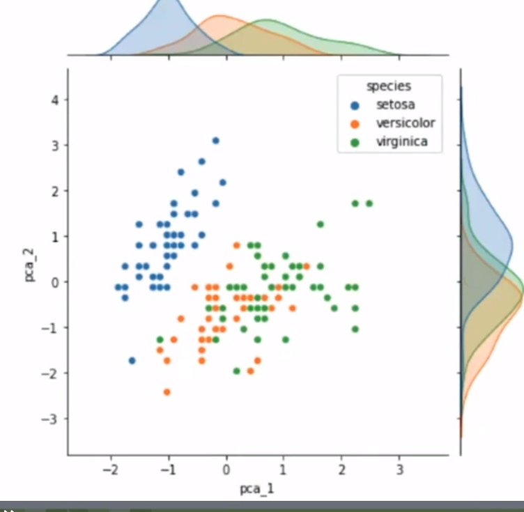

## PCA: análisis de componentes principales

| Source:       | https://platzi.com/clases/estadistica-descriptiva/           |
| ------------- | ------------------------------------------------------------ |
| **Course:**   | Curso de Matemáticas para Data Science: Estadística Descriptiva |
| **Teacher:**  | Francisco Camacho                                            |
| **Notebook:** | [Personal deepnote](https://deepnote.com/project/curso-estadistica-descriptiva-2021-Duplicate-7uTueWZDQ-aKrq24bLdf2A) |

## Notes

## Recomendación

En el curso de Curso de Álgebra Lineal Aplicada para Machine Learning se ven más a fondo las bases de álgebra lineal y además al final se hace un proyecto aplicado a imágenes donde aplicando PCA con 44 componentes logramos capturar el 80 de la información. Les dejo el curso para que lo cursen, 100% recomendado:

- [Curso de Álgebra Lineal Aplicada para Machine Learning](https://platzi.com/clases/algebra-ml/)

Si desean ver detalles matemáticos del teorema que describe la varianza de un conjunto de datos con varias variables en términos de la matriz de covarianza, pueden revisar la pagina 149 del libro guía del curso:

https://cims.nyu.edu/~cfgranda/pages/stuff/probability_stats_for_DS.pdf

## Dato curioso:

------

Les comparto unas variaciones que pueden ser utilidad de PCA:

- **PCA para compresión**
- **PCA aleatorio**
- **PCA incremental**
- **Kernel PCA**

## Proyeccion (Sombra) de un vector:

Reducción de dimensionalidad con PCA

```python
import numpy as np 
import pandas as pd 
import matplotlib.pyplot as plt
import seaborn as sns
from sklearn.preprocessing import StandardScaler


iris = sns.load_dataset('iris')

scaler = StandardScaler()
scaled = scaler.fit_transform(
    iris[['sepal_length', 'sepal_width', 'petal_length', 'petal_width']].values
    )

# Matriz de covarianza como en la clase anterior
covariance_matrix = np.cov(scaled.T)
covariance_matrix
```

```python
sns.jointplot(x= iris['petal_length'], y=iris['petal_width'])
sns.jointplot(x = scaled[:, 2], y = scaled[:,3])
```

Descomposicion en vectores y valores propios: https://numpy.org/doc/stable/reference/generated/numpy.linalg.eig.html

```python
#Eig viene del aleman valor propio. Ojo jajaja
eigen_values, eigen_vectors = np.linalg.eig(covariance_matrix)


eigen_values
eigen_vectors
```

```python
variance_explained = []

for i in eigen_values:
    variance_explained.append((i/sum(eigen_values))*100)

print(variance_explained)

# 72.9 y 22.8 % son los mayores 
```

PCA con scikit : https://scikit-learn.org/stable/modules/generated/sklearn.decomposition.PCA.html

```python
from sklearn.decomposition import PCA

pca = PCA(n_components=2) # Reducir mis datos a dos componentes
pca.fit(scaled) # No son los datos originales, usamos los datos escalados

# Me indica las dos direcciones con mas varianza 0.729 , 0.228
pca.explained_variance_ratio_


# Solo muestra dos componentes mas importantes
reduced_scaled = pca.transform(scaled)

# Voy a ingresar como colunmas adicionales las dos componentes reducidas
# El dataset iris tiene las dos nuevas columnas

iris['pca_1'] = scaled[:,0] # Primera componente
iris['pca_2'] = scaled[:,1] # Segunda componente

#Graficamos el dataset
sns.jointplot(iris['pca_1'], iris['pca_2'], hue = iris['species'])


```



Con estos datos puedo empezar a trabajar con modelos, PCA nos permite reducir de 4 a dos componentes para nuestro modelo. Tenemos un `72.9 + 22.8 =  aprox 95%` de la covarianza original.

## Resumen del curso

------

- **Visión de la estadística descriptiva:** Resumir información con números y con visualizaciones
- La estadística descriptiva nos permite trabajar con 2 bloques fundamentales de la ciencia de datos:
  - El análisis exploratorio de datos y en el procesamiento de la información, antes de pasar al modelo de Machine Learning.
- **¿Por qué es tan importante el procesamiento de datos?** El procesamiento de datos es muy importante para que todo tenga un formato estandarizado para que sea de fácil entendimiento para un modelo de Machine Learning. Sabiendo eso, las correlaciones son fundamentales para ver que variables tienen una alta relación y de ahí evidenciar que puede haber variables que pueden resultan redundantes para el modelo
- **Y como conclusión final vimos la técnica PCA:** el análisis de componentes principales es una técnica utilizada para describir un conjunto de datos en términos de nuevas variables no correlacionadas.