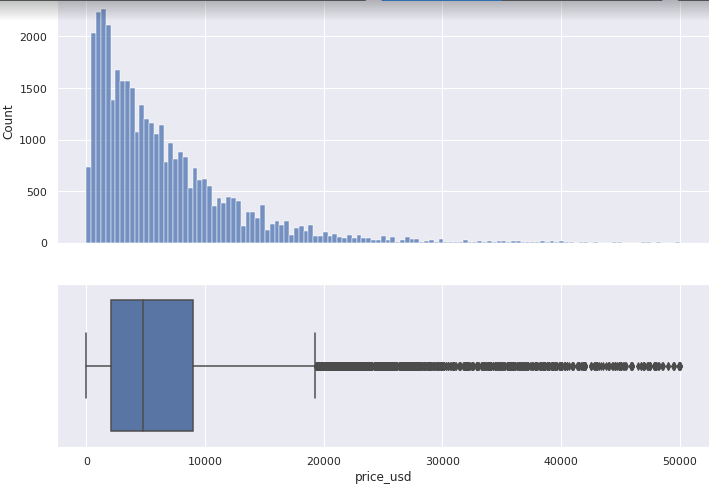
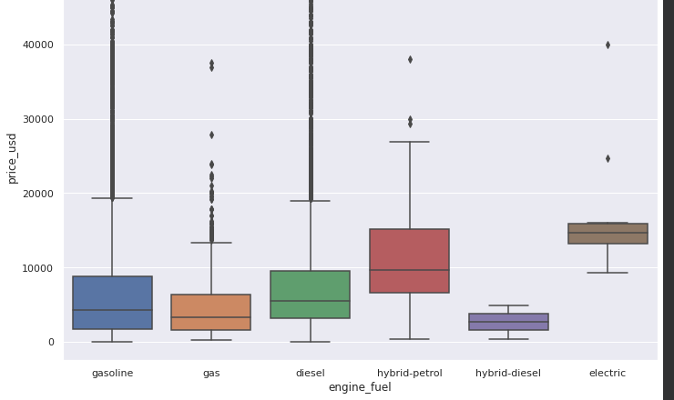

## Medidas de dispersión en Python

| Source:       | https://platzi.com/clases/estadistica-descriptiva/           |
| ------------- | ------------------------------------------------------------ |
| **Course:**   | Curso de Matemáticas para Data Science: Estadística Descriptiva |
| **Teacher:**  | Francisco Camacho                                            |
| **Notebook:** | [Personal deepnote](https://deepnote.com/project/curso-estadistica-descriptiva-2021-Duplicate-7uTueWZDQ-aKrq24bLdf2A) |

## Notes

```python
import pandas as pd 
import matplotlib.pyplot as plt
import seaborn as sns

df = pd.read_csv('cars.csv')
```

```python
# Desviación estandar
df['price_usd'].std()
```

```python
# Rango = valor max - valor min
rango = df['price_usd'].max() - df['price_usd'].min()
rango
```

```python
# Quartiles
median = df['price_usd'].median()

# Quantile consiste en dividir la distribucion es espacion homogeneos 4 o 100 partes. 
Q1 = df['price_usd'].quantile(q=0.25)
Q3 = df['price_usd'].quantile(q=0.75)

# Minimo 
min_val = df['price_usd'].quantile(q=0)

# Maximo 
max_val = df['price_usd'].quantile(q=1.0)

print(min_val, Q1, median, Q3, max_val)
```

```python
# Rango inter cuartil
iqr = Q3 - Q1
iqr
```

### Límites para detección de outliers (datos simetricamente distribuidos)

Datos entre $Q1−1.5×IQR -1.5 \times $ y $Q3+1.5×IQR$

```python
inlimit = Q1 - 1.5*iqr
maxlimit = Q3 + 1.5*iqr

# Esta distribucion no es simetrica, por eso el limite inferior {inlimit} es negativo.
print('rango para detección de outliers: {}, {}'.format(minlimit, maxlimit))
```

```python
sns.set(
	rc={'figure.figsize':(11.7,8.27)}
)

f, (ax_hist, ax_box) = plt.subplots(
    2, 
    sharex=True, 
    gridspec_kw={"height_ratios": (.6, .4)}
)

sns.histplot(df['price_usd'], ax=ax_hist)
sns.boxplot(df['price_usd'], ax=ax_box)

ax_hist.set(xlabel='')
```



Es posible calcular varios `box-plot` separando por una cierta variable categórica:

```python
sns.boxplot(x = 'engine_fuel', y = 'price_usd', data = df)
```



## Asimetría en distribuciones

Como vimos en la clase, el hecho de que nuestra distribución tenga una tendencia a la derecha o a izquierda nos representa un problema, ya que no a acorde con una distribución y eso puede afectar a nuestros análisis si no tomamos en cuenta ese sesgo. No siempre hay que confiar en nuestra intuición o lo que vemos a simple vista, hay métodos como:

- Primer coeficiente de asimetría de Pearson (asimetría de modo)
- Segundo coeficiente de asimetría de Pearson (asimetría mediana)
- Coeficiente de Groeneveld y Meeden
- Coeficiente de Fisher

Por mencionar algunos.

#### Y por último, no hay que olvidar la curtosis:

Una curtosis grande implica una mayor concentración de valores de la variable tanto muy cerca de la media de la distribución (pico) como muy lejos de ella (colas), al tiempo que existe una relativamente menor frecuencia de valores intermedios. Esto explica una forma de la distribución de `frecuencias/probabilidad` con colas más gruesas, con un centro más apuntado y una menor proporción de valores intermedios entre el pico y colas.
Una mayor curtosis no implica una mayor varianza, ni viceversa.

