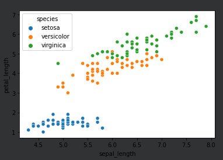

## Exploración visual de los datos

| Source:       | https://platzi.com/clases/estadistica-descriptiva/           |
| ------------- | ------------------------------------------------------------ |
| **Course:**   | Curso de Matemáticas para Data Science: Estadística Descriptiva |
| **Teacher:**  | Francisco Camacho                                            |
| **Notebook:** | [Personal deepnote](https://deepnote.com/project/curso-estadistica-descriptiva-2021-Duplicate-7uTueWZDQ-aKrq24bLdf2A) |

## Notes


- Diagrama de caja o Boxplot
- Histograma

[Mas informacion sobre graficas ...](https://datavizproject.com/data-type/marimekko-chart/)

## Diagrama de dispersión en el análisis de datos 




## Mas información sobre gráficas importantes

> - [Joint Plot ](https://seaborn.pydata.org/generated/seaborn.jointplot.html)
> - [Bar Plot](https://seaborn.pydata.org/generated/seaborn.barplot.html)
> - [Box Plot](https://seaborn.pydata.org/generated/seaborn.boxplot.html)
> - [Scatter Plot](https://seaborn.pydata.org/generated/seaborn.scatterplot.html)


## Código de referencia 

```python
import pandas as pd 
import seaborn as sns

iris = sns.load_dataset('iris')

iris.head()
```

```python
# scatterplot 
sns.scatterplot(data=iris, x = 'sepal_length', y = 'petal_length', hue = 'species')
```


```python
# joint plot (Ojo esta genial)
sns.jointplot(data=iris, x = 'sepal_length', y = 'petal_length', hue = 'species')
```

```Python
# box plot 
sns.boxplot(x = 'species', y = 'sepal_length', data = iris)
```

```Python
#Barplot
sns.barplot(x = 'species', y = 'sepal_length', data = iris)
```

## La **curtosis**

> La **curtosis** es una medida estadística que determina el grado de concentración que presentan los valores de una variable alrededor de la zona central de la distribución de frecuencias. También es conocida como medida de apuntamiento.

## Tipos de curtosis

Dependiendo del grado de curtosis, tenemos tres tipos de distribuciones:

**1. Leptocúrtica:** Existe una gran concentración de los valores en torno a su media (g2>3)

[](https://economipedia.com/wp-content/uploads/2017/09/Leptocurtica-2.jpg)

**2. Mesocúrtica:** Existe una concentración normal de los valores en torno a su media (g2=3).

[](https://economipedia.com/wp-content/uploads/2017/09/normal.jpg)

**3. Platicúrtica:** Existe una baja concentración de los valores en torno a su media (g2<3).

[](https://economipedia.com/wp-content/uploads/2017/09/Platicurtica.jpg)


## Reto:

#### Conclusiones:

Hay una diferencia bastante marcada con el largo y ancho del pétalo, entre las especie. La distribución de la setosa es `leptocútica`, osea, tiene sus medidas muy comunes entre si, en el caso de la versicolor su distribución tiende un poco a ser `mesocútica` parece un poco sesgada a la derecha eso podría indicar que también tiene muchas medidas comunes pero igual una gran parte son bastante altas, fuera de lo normal y por último la virginica, es justo al revés que la versicolor, solo que veo que tiende ser una distribución más `platicúrtica.`


En el caso de el largo y ancho del sepalo, la diferencia no es tanta. De hecho, vemos que la versicolor y la virginica comparten varios atributos en común, pero la setosa comparte muy pocos. Igual que las distribuciones anteriores estas tienen bastante curtosis y están algo sesgadas tanto a la derecha como a la izquierda.


